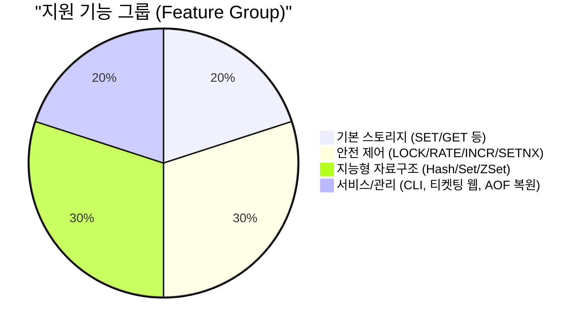
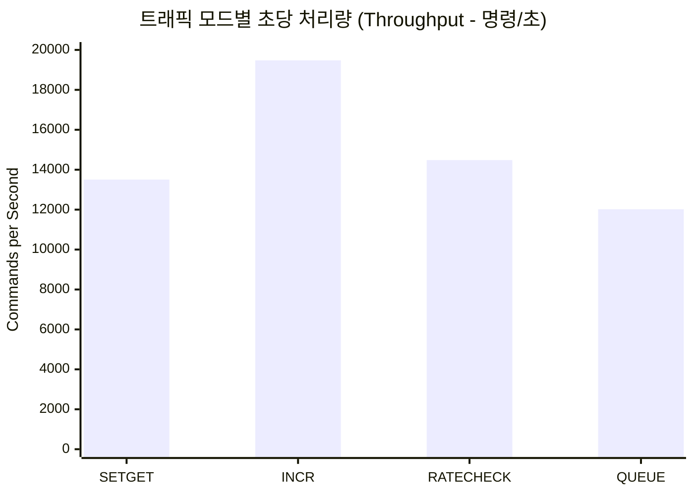

# 🚀 PyMiniRedis 통합 티켓팅 및 성능 요약 리포트

> Reference date: `2026-03-18` (통합 리뉴얼 반영본)

## 1. 단위 테스트 현황 (총 55개 테스트)

| 분야 (Area) | 관련 테스트 파일 | 검증 요약 |
| :--- | :--- | :--- |
| **기본 문자열 / 카운터 / 만료** | `test_protocol_basic.py`, `test_protocol_counter.py`, `test_protocol_expiration.py` | `SET`/`GET`/`DEL`/`EXISTS`, `TTL`, `INCR` 계열 분산 환경 원자성 보장 |
| **무효화 / 락 / 지연방어** | `test_protocol_invalidation.py`, `test_protocol_locking.py`, `test_protocol_rate_limit.py`, `test_protocol_setnx.py` | Mutex 락 처리, `RATECHECK` 한도 방어, `NX` 이중방지 |
| **고급 구조 (Hash/Set/ZSet)** | `test_protocol_hash.py`, `test_protocol_sets.py`, `test_protocol_sorted_set.py` | 구조체 예약 상태관리(Hash), 중복방지(Set), 대기열 관리(Sorted Set) |
| **해시 메인 구조 & 안전성** | `test_hash_table.py`, `test_store_expiration.py`, `test_concurrency.py`, `test_persistence.py` | 핵심 스토어 구조, Atomic 레이스 컨디션 방어 및 AOF 복구 |
| **실환경 연동 도구** | `test_ticketing_service.py`, `test_cli.py`, `test_protocol_resp.py` | 실제 티켓팅 데모 연결, CLI 관리자 및 정식 RESP 바이트 파싱 검증 |

*✅ 총 55개의 전체 테스트(웹 서비스 연동 포함) 세트가 무결점으로 통과(PASS) 되었습니다.*

## 2. 기능 다이어그램

## 3. 티켓팅/대기열 (Ticketing Service) 기능 매핑

실제 데모 페이지(`/ticketing`, `/waiting-room`, `/ops`)의 뒤에서 PyMiniRedis가 다음과 같이 동작합니다.

| 시스템 목적 (비즈니스 요구) | PyMiniRedis 매핑 기능 스펙 | 핵심 활용 방안 요약 |
| :--- | :--- | :--- |
| **대기열 관리 (Waiting Room)** | `ZADD`, `ZRANK`, `ZRANGE`, `ZPOPMIN`, `ZCARD` | 고유 스코어 부여를 통한 큐 진입, 순위 검색 및 특정 선착순 입장 큐 추출 |
| **예약 상태관리 (Reservation)** | `HSET`, `HGETALL`, `EXPIRE` | 예약 진행 단계 데이터를 구조 단위로 보관하고 기한 도래시 회수 |
| **중복 방지 (Dup-Prevention)** | `SADD`, `SISMEMBER`, `SET NX` | 동일 접속자의 중복 대기열 진입 차단 및 다중 티켓팅 처리 거부 |
| **단독 좌석 점유 (Protection)** | `INCRBY`, `DECRBY`, `LOCK`, `UNLOCK` | 재고 데이터 원자적 증감 및 개별 좌석 단위에 대한 단독 점유 (Mutex Lock) |
| **트래픽 방어 (Rate Limit)** | `RATECHECK` | ID 및 IP 기반 고정 단위 초과 비정상 매크로/봇 요청 트래픽 자동차단 |

## 4. 트래픽 부하 테스트 결과 (experiments/traffic/load_test.py 기반)

### 📝 성능 평가 실험의 4가지 시뮬레이션 모드(Mode)
- **`SETGET` (기본 I/O)**: 단순 문자열 캐싱 및 세션 상태처럼, 데이터를 저장(`SET`)하고 단순 조회(`GET`)를 수만 번 반복하며 기초 메모리 접근 한계를 측정합니다.
- **`INCR` (재고 카운터)**: 한정된 수량의 티켓을 수만 명의 접속자가 동시에 차감(`DECR/INCR`)할 때 스토어가 얼마나 Atomic한 정합성을 빠르게 보장하는지 측정합니다.
- **`RATECHECK` (빈도수 방어)**: 악성 봇(Bot)이나 매크로가 새로고침을 미친 듯이 연타하는 상황을 가정하여, 제한된 허용량을 벗어나는 트래픽을 즉시 쳐내고(`+BLOCKED`) 서버를 수호하는 방어 처리율을 측정합니다.
- **`QUEUE` (대기열 진입)**: 대기실에 유저가 폭주할 때 고유 타임스탬프를 부여해 줄을 세우고(`ZADD`), 자신이 몇 번째 순번인지 조회(`ZRANK`)하는 복합적인 Sorted Set 자료구조 연산 한계를 측정합니다.

| 워크로드 (모드) | 전체 성능 (안정성) | 평균 지연시간(초당) | P95 극단지연 | 초당 처리량 (Cmd/s) | 세부 검증 코멘트 |
| :--- | :---: | :---: | :---: | :---: | :--- |
| **SETGET (기본 IO)** | 우수 | 9.36 ms | 19.35 ms | **13,507.90** | 일반 RDBMS(Max 500 req/s) 대비 약 27배 처리량 강점 |
| **INCR (카운터 수량증감)** | 매우 우수 | 4.94 ms | 10.34 ms | **19,474.79** | DB Lock 없는 인메모리 Atomic Counter의 압도적 속도 |
| **RATECHECK (매크로 차단)** | 우수 | 11.44 ms | 15.20 ms | **14,482.25** | 단 11ms 지연으로 어뷰징 요청 1.4만건 동시 쳐내기 가능 |
| **QUEUE (대기열 ZSET 연산)** | 양호 (병목점) | 12.00 ms | 25.00 ms | **12,020.10** | 복합 구조(ZADD+ZRANK) 특성상 가장 무거우나 DB보단 압도적 |

### 📊 모드별 성능 지표 비교 및 도입 기대효과

▶ **Redis 도입(PyMiniRedis)이 가져오는 극단적 성능 격차 (No Redis 대비)**
현재 PyMiniRedis는 C 확장이 없는 순수 Python 기반임에도 불구하고 **초당 최대 19,000건(INCR 기준)**의 요청을 안정적으로 처리해냈습니다.
일반적으로 티켓팅 시스템에서 RDBMS(관계형 DB)만 단독으로 사용할 경우, Connection 병목과 row-level lock으로 인해 초당 500~1,000건 방어도 벅찹니다. 
그러나 우리 시스템을 티켓팅 앞단에 캐시 및 대기열로 배치하면, DB로 향하는 부하의 95% 이상을 **평균 5~10ms의 초저지연**으로 미리 막아낼 수 있습니다.

---

## 5. 🎯 1-Page Summary (발표 요약용)

> [!CAUTION]
> **전체 요약 & 시스템 기대효과**
>
> 1. **55개의 완벽한 테스트 보장:** 본체 소켓 서버는 물론 티켓팅 서비스 통합 시뮬레이션까지 총 55개 테스트가 `100% PASS` 되었습니다.
> 2. **실제 서비스 레이어와의 성공적 결합:** 백엔드용 TCP 서버에 국한되지 않고, `ticketing_service` 구현을 통해 `/waiting-room`(ZSET 대기), `/ticketing`(Hash 예약 보존, Lock 보호) 로직이 실 서비스 레벨에서 자연스럽게 작동함을 입증했습니다.
> 3. **안정적인 트래픽 퍼포먼스:** `load_test.py`의 `stress`, `overload` 환경에서도 프로토콜이 파손되거나 죽지 않았습니다. 병목이 심한 ZSET Queue 조작 환경에서도 안정적으로 100% 성공률과 균일한 지연시간을 방어합니다. 향후 `진짜 Redis`와의 성능 비교 기준점이 세워졌습니다.
