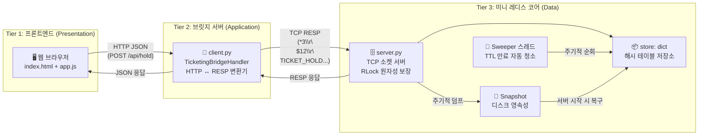
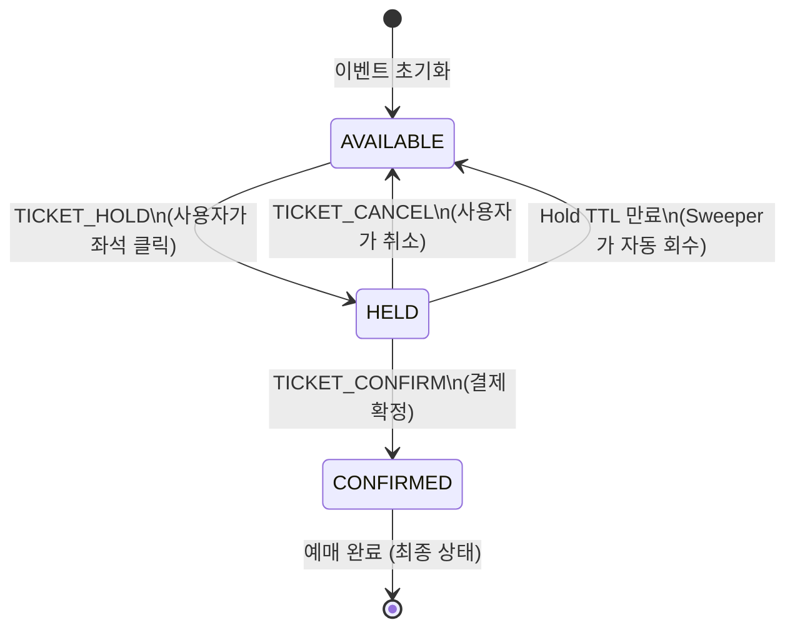
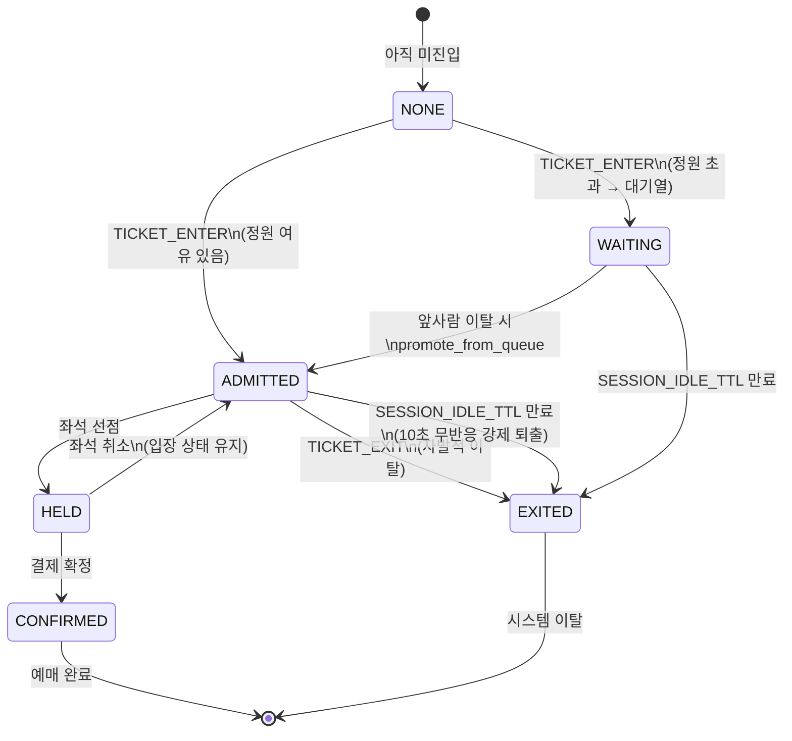
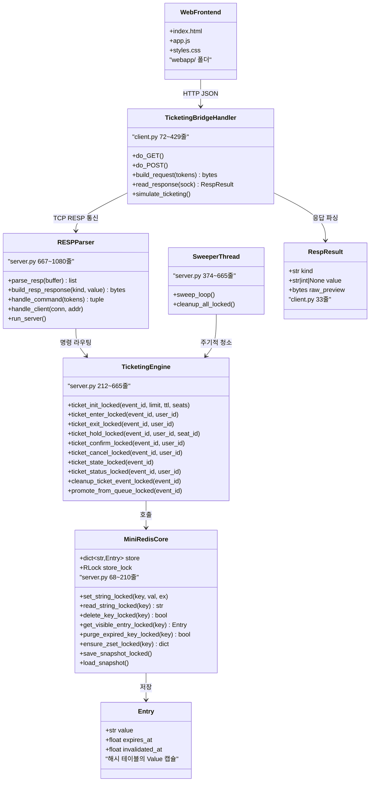
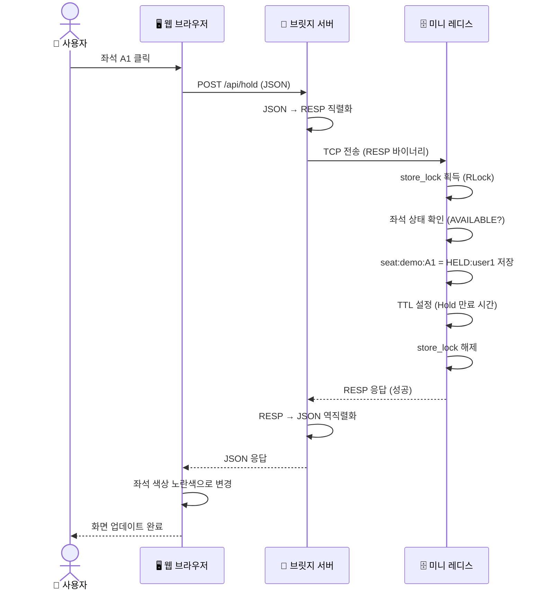
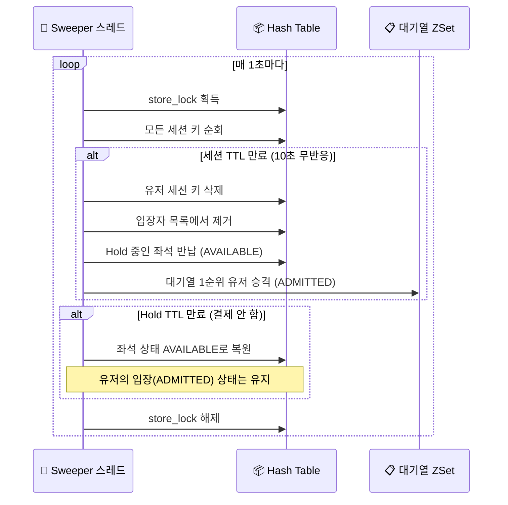

# 🏗️ 시스템 아키텍처 다이어그램 (발표용 시각화)

> 아래 다이어그램들은 **Mermaid** 문법으로 작성되어, GitHub의 README나 VSCode의 Mermaid Preview 확장 등에서 자동으로 시각화됩니다.

---

## 1. 🌐 전체 시스템 흐름도 (3-Tier Architecture)

사용자의 클릭이 어떻게 최종적으로 데이터를 변경하는지에 대한 **전체 데이터 여행 경로**입니다.

---

## 2. 🎫 좌석 예매 상태 전이도 (State Machine)

하나의 좌석이 거칠 수 있는 모든 상태 변화와 트리거(원인)를 보여줍니다.

---

## 3. 👤 사용자 입장/대기 상태 전이도

유저가 티켓팅 시스템에 진입할 때 거치는 상태 변화입니다.

---

## 4. 🔧 클래스 & 모듈 구조도

프로젝트의 핵심 클래스와 함수들이 어떤 파일에 속하고, 서로 어떤 관계인지를 보여줍니다.

---

## 5. 📡 요청 1건의 전체 여행 (Sequence Diagram)

사용자가 **좌석 Hold 버튼을 누르는 순간**부터 **화면에 결과가 표시**되기까지의 전체 여정입니다.

---

## 6. ⏱️ TTL 만료 & Sweeper 동작 흐름

백그라운드에서 조용히 돌아가며 만료된 데이터를 청소하는 **Sweeper 스레드**의 동작입니다.

